# Capstone Virtual Fitting Platform

단일 전신 사진 기반 3D 아바타 재구성, 3D 의류 자동 피팅, 웹 360도 렌더링 목표의 가상 피팅 플랫폼 설계 저장소

## Table of Contents

- [1. Repository Status](#1-repository-status)
- [2. Product Overview](#2-product-overview)
- [3. Scope Definition](#3-scope-definition)
- [4. Core Design Principles](#4-core-design-principles)
- [5. End-to-End Architecture](#5-end-to-end-architecture)
- [6. User Flow](#6-user-flow)
- [7. Runtime Sequence](#7-runtime-sequence)
- [8. Job Lifecycle](#8-job-lifecycle)
- [9. Frontend Design](#9-frontend-design)
- [10. Backend API Design](#10-backend-api-design)
- [11. AI Reconstruction Pipeline](#11-ai-reconstruction-pipeline)
- [12. Garment Asset Pipeline](#12-garment-asset-pipeline)
- [13. Virtual Fitting Engine](#13-virtual-fitting-engine)
- [14. Data Architecture](#14-data-architecture)
- [15. Storage Layout](#15-storage-layout)
- [16. Queue and Worker Topology](#16-queue-and-worker-topology)
- [17. Deployment Topology](#17-deployment-topology)
- [18. Security and Privacy](#18-security-and-privacy)
- [19. Observability and QA](#19-observability-and-qa)
- [20. Performance Targets](#20-performance-targets)
- [21. Failure Handling](#21-failure-handling)
- [22. Repository Blueprint](#22-repository-blueprint)
- [23. Roadmap](#23-roadmap)
- [24. Recommended Build Order](#24-recommended-build-order)
- [25. Core Risks](#25-core-risks)
- [26. Reference](#26-reference)

## 1. Repository Status

### Current Repository State

- 설계 문서 중심 저장소
- 실제 서비스 코드 미구현 상태
- 프론트엔드, API, 워커, 인프라 부트스트랩 전 단계
- 아키텍처 의사결정 및 구현 기준 정리 목적

### Repository Purpose

- 제품 범위 확정
- 프론트엔드, 백엔드, AI, 3D 처리 경계 정의
- 장시간 연산 파이프라인의 job 기반 비동기 구조 설계
- 단일 이미지 입력 한계의 제품 정책 반영
- 이후 코드 작성 시 공통 기준 제공

### Non-Goals of Current Repository

- 즉시 실행 가능한 production 서비스 제공 목적 아님
- 모델 체크포인트 배포 저장소 목적 아님
- 정제 완료 의류 자산 저장소 목적 아님

## 2. Product Overview

### Product Goal

사용자 전신 사진 1장 업로드 후, 서버 측에서 표준화된 body representation 생성, 선택 의류 자동 피팅, 최종 `.glb` 생성, 브라우저 내 360도 결과 확인까지의 end-to-end 흐름 구축 목표

### Core Product Value

- 사진 기반 빠른 가상 피팅 경험
- 의류 카탈로그 중심 체험형 3D 결과 제공
- 별도 앱 설치 없는 웹 기반 접근성
- 표준 body representation 기반 재사용 가능한 pipeline 구조

### Why This Product Is Hard

- 단일 사진 입력 특성
- 후면/측면 직접 관측 불가
- loose clothing에 따른 체형 추정 왜곡
- body reconstruction과 garment fitting 품질의 상호 의존성
- 웹 렌더링, GPU 추론, Blender 처리의 이질적 스택 결합 필요

## 3. Scope Definition

### MVP Scope

- 입력: 정면 전신 사진 1장
- 대상: 성인 1명, 단독 피사체
- 배경: 단순 배경 권장
- 지원 카테고리: `top`, `bottom`, `outer`, `dress`
- 출력 형식: 웹 렌더링 가능한 `.glb`
- 처리 시간 목표: 약 20~60초
- 결과 성격: 실제 신체 완전 복원 아님, 시뮬레이션 기반 피팅 결과

### Early Version Out of Scope

- 실시간 webcam fitting
- 다중 인물 처리
- 극단적 포즈
- 정확한 사이즈 추천 보장
- 고정밀 얼굴/손가락 복원
- 임의 2D 의류 이미지의 즉시 3D 자산화

### Product Assumptions

- 사용자 업로드 이미지 품질 통제 가능성
- 표준화된 garment asset 사전 확보 가능성
- GPU 서버 운영 가능성
- 비동기 job 처리 UX 수용 가능성

## 4. Core Design Principles

### Principle 1: Direct Final Mesh Generation 지양

핵심 기준:

- 사진에서 곧바로 최종 결과 생성 방식 지양
- 중간 산출물 분리 저장 필수
- 디버깅 가능한 pipeline 구조 우선

필수 intermediate artifacts:

- 정제된 입력 이미지
- person mask
- 2D keypoints
- SMPL 또는 SMPL-X parameters
- canonical body mesh
- measurement data
- texture assets
- garment fitting intermediate result

### Principle 2: Job-Based Async Processing

핵심 기준:

- 긴 연산의 HTTP 동기 처리 금지
- `job_id` 중심 상태 관리
- SSE 또는 polling 기반 진행률 노출
- 단계별 재시도와 실패 분기 분리

### Principle 3: FastAPI의 역할 제한

FastAPI의 주 역할:

- 요청 접수
- 인증/인가
- presigned upload URL 발급
- job 생성
- 상태 조회
- 결과 메타데이터 반환

FastAPI의 비목표:

- GPU 추론 직접 수행
- Blender fitting 직접 수행
- 대용량 파일 직접 중계

### Principle 4: Canonical Body 우선

중요 기준:

- 최종 렌더링용 예쁜 mesh보다 canonical body 우선
- 표준 좌표계, 표준 포즈, 표준 단위 확보 중요
- 이후 fitting, measurement, asset alignment 전부의 기준점 역할

canonical body 필수 속성:

- 단위: meter
- 기준 포즈: A-pose 또는 T-pose
- 원점: pelvis center
- 정면 방향 통일
- skeleton naming 통일
- measurement extraction 가능 구조

### Principle 5: Garment Standardization 선행

런타임 전 보장 필요 항목:

- 단위 정규화
- pose 정규화
- origin/pivot 정리
- material 연결
- 카테고리 태깅
- anchor 혹은 rig 정리
- fit metadata 보유

## 5. End-to-End Architecture

### High-Level Architecture

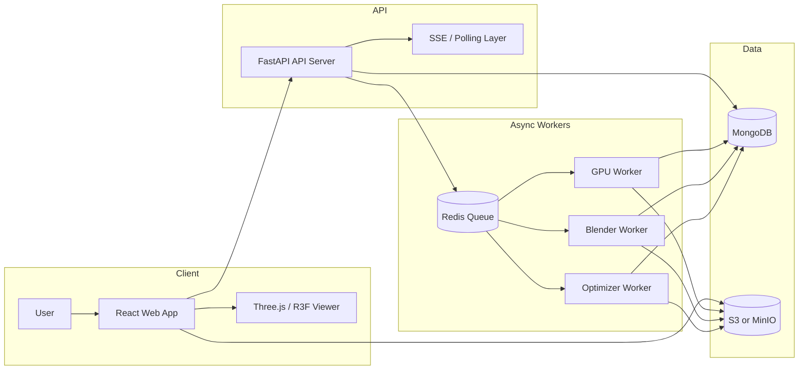

### Architecture Layer Summary

| Layer | 책임 |
|---|---|
| Client | 업로드, 상태 표시, 결과 렌더링 |
| API | job orchestration, auth, metadata |
| GPU Worker | segmentation, pose, body reconstruction |
| Blender Worker | scaling, rig alignment, draping |
| Optimizer Worker | glTF, texture 최적화 |
| MongoDB | 상태/메타데이터 저장 |
| S3/MinIO | 바이너리 산출물 저장 |

### Core Boundary

- API Server: orchestration 중심
- GPU Worker: AI 처리 전담
- Blender Worker: geometric fitting 전담
- Optimizer Worker: delivery artifact 최적화 전담

## 6. User Flow

### User Journey

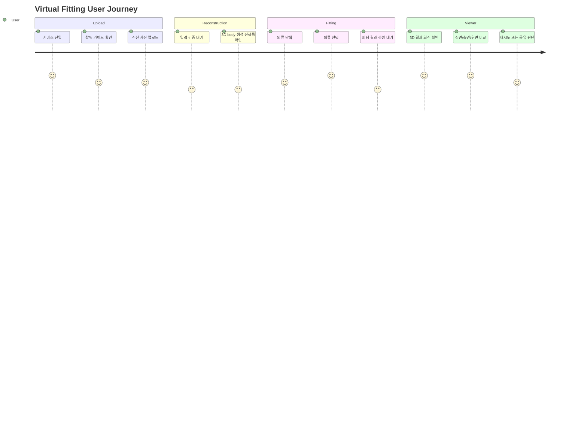

### User-Facing Flow Summary

1. 업로드 가이드 확인
2. 이미지 선택 및 업로드
3. 입력 품질 검사
4. body reconstruction 대기
5. garment 선택
6. fitting 대기
7. 최종 viewer 로드
8. 결과 회전 및 확인

### UX Priorities

- 업로드보다 입력 품질 통제 중요
- 진행 상태의 단계별 노출 중요
- 실패 시 재촬영 가이드 중요
- 결과의 성격을 "예상 시뮬레이션"으로 명확히 전달 필요

## 7. Runtime Sequence

### End-to-End Sequence Diagram

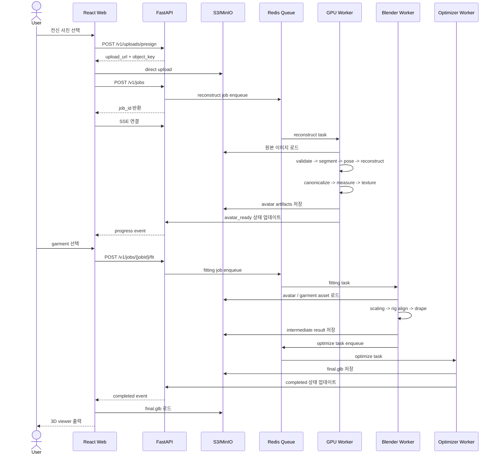

### Runtime Summary

- 업로드 경로: browser -> object storage direct upload
- orchestration 경로: browser -> API -> queue -> workers
- 결과 전달 경로: worker -> storage + DB -> API metadata -> browser viewer
- 장점: API 대역폭 절약, 긴 연산과 요청 수명 분리, 장애 원인 추적 용이

## 8. Job Lifecycle

### Job State Machine

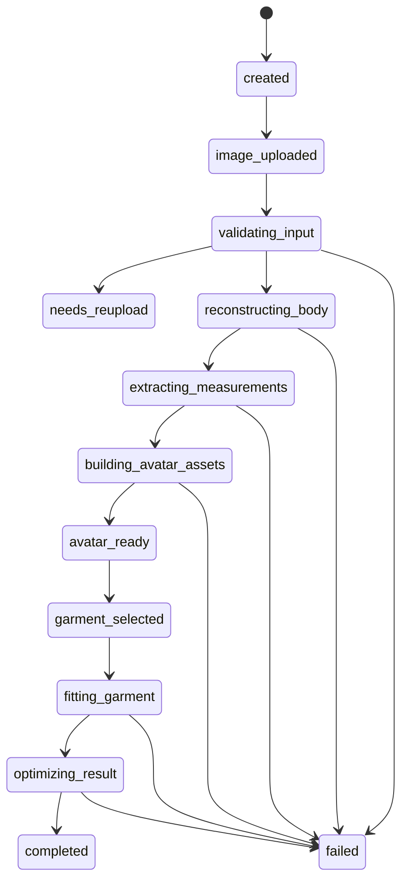

### Job Status Ownership

| 상태 구간 | 담당 |
|---|---|
| `created`, `image_uploaded`, `garment_selected`, `completed` | API |
| `validating_input` ~ `avatar_ready` | GPU Worker |
| `fitting_garment` | Blender Worker |
| `optimizing_result` | Optimizer Worker |
| `failed`, `needs_reupload` | 해당 단계 워커 |

### Progress Step Model

| progress_step | 사용자 표시 의미 |
|---|---|
| `uploading_image` | 이미지 업로드 중 |
| `validating_image` | 입력 이미지 검사 중 |
| `segmenting_person` | 인체 분리 중 |
| `estimating_pose` | 포즈 추정 중 |
| `reconstructing_mesh` | 3D 바디 생성 중 |
| `extracting_texture` | 텍스처 생성 중 |
| `measuring_body` | 신체 기준 계산 중 |
| `loading_garment` | 의류 불러오는 중 |
| `scaling_garment` | 의류 크기 조정 중 |
| `draping_garment` | 의류 형상 보정 중 |
| `optimizing_glb` | 최종 모델 최적화 중 |
| `done` | 완료 |

### Job Design Reasons

- 긴 연산 처리 적합성
- 상태 추적 용이성
- 재시도 정책 분리 용이성
- 사용자 UX 개선 가능성
- 운영 관측성 향상

## 9. Frontend Design

### Frontend Responsibility

- 입력 가이드 노출
- 업로드 전 즉시 검증
- 상태 스트리밍 구독
- garment catalog 탐색
- 3D 결과 렌더링
- 실패/재시도 UX 제공

### Frontend Page Map

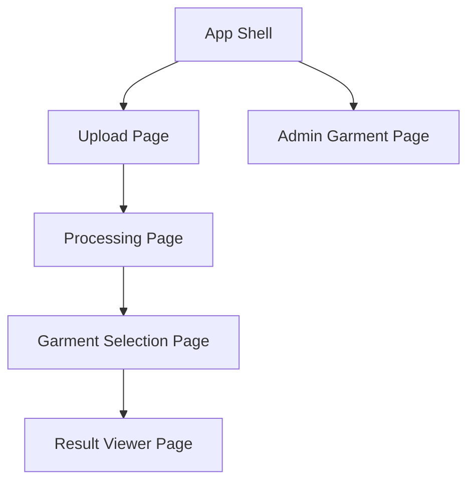

### Frontend Component Map

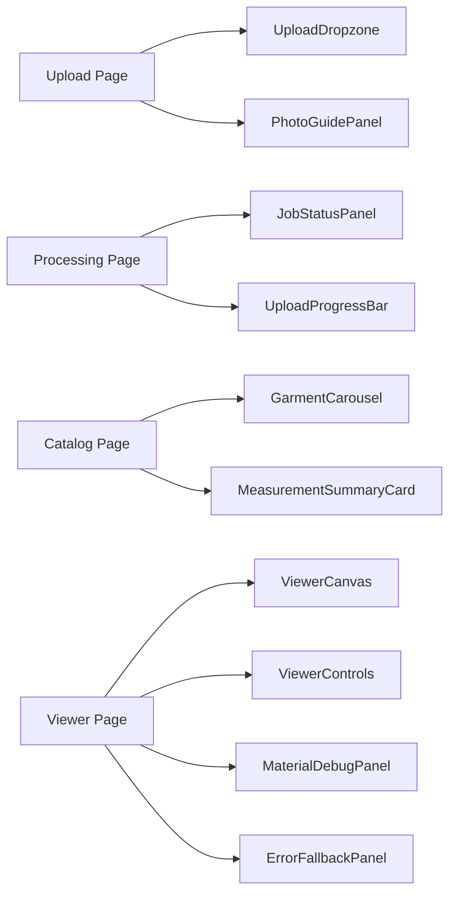

### Upload UX Requirements

- 전신 전체 프레임 포함 필요
- 머리와 발 미절단 중요
- 팔/다리 occlusion 최소화 필요
- 정면에 가까운 포즈 권장
- 단순 배경 권장
- 저조도/흔들림 이미지 지양

### Client-Side Validation

| 항목 | 예시 기준 |
|---|---|
| 파일 형식 | `jpg`, `jpeg`, `png`, `webp` |
| 최대 용량 | 15MB |
| 최소 해상도 | 1024x1536 |
| EXIF 보정 | 필수 |
| 사진 방향 | 세로 이미지 권장 |

### State Management

- React Query: job 상태, garment 목록, result metadata
- Zustand: 선택 garment, viewer UI 상태, 업로드 임시 상태

### 3D Viewer Rendering Pipeline

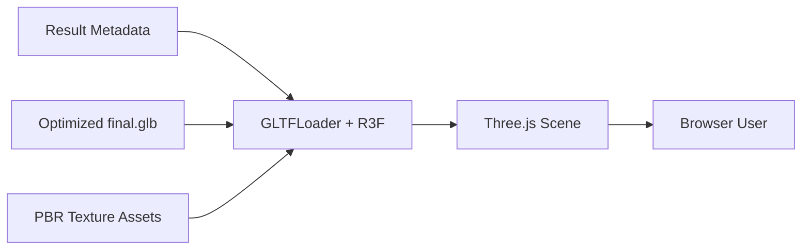

### Viewer Design Priorities

- OrbitControls 기반 자유 회전
- 정면/측면/후면 preset 제공
- HDRI 기반 environment lighting
- PBR material 최대한 유지
- 모바일 DPR 제한
- 로딩 스피너 및 asset preload 지원

## 10. Backend API Design

### Backend Responsibility Split

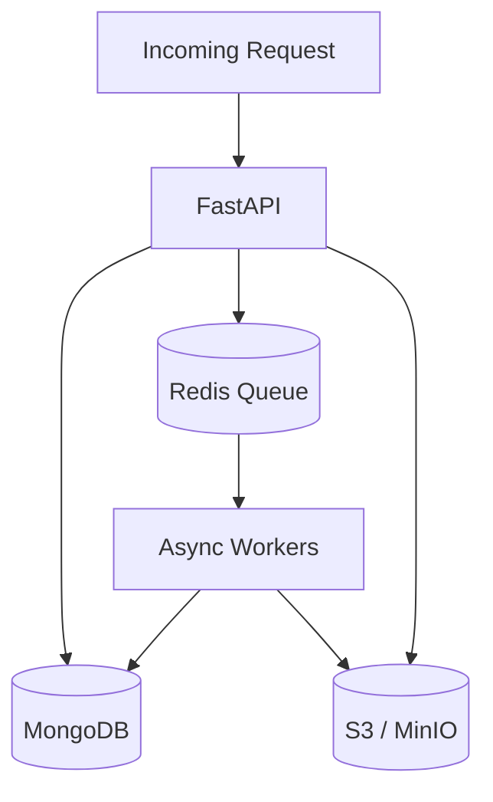

### API Server Responsibility

- auth / permission
- presigned upload URL 발급
- job 생성
- job 상태 조회
- garment catalog 제공
- result metadata 제공
- worker event의 사용자 친화적 변환

### Major Resource IDs

- `job_id`: 전체 처리 흐름 기준 식별자
- `avatar_id`: body reconstruction 산출물 식별자
- `garment_id`: 의류 자산 식별자
- `result_id`: 최종 fitting 결과 식별자

### Main Endpoints

| Method | Endpoint | 목적 |
|---|---|---|
| `POST` | `/v1/uploads/presign` | direct upload URL 발급 |
| `POST` | `/v1/jobs` | body reconstruction job 생성 |
| `GET` | `/v1/jobs/{jobId}` | job 상태 조회 |
| `GET` | `/v1/jobs/{jobId}/events` | SSE 구독 |
| `GET` | `/v1/garments` | garment 목록 조회 |
| `POST` | `/v1/jobs/{jobId}/fit` | fitting 시작 |
| `GET` | `/v1/results/{resultId}` | 최종 결과 정보 조회 |
| `POST` | `/v1/admin/garments` | 관리자 의류 등록 |
| `POST` | `/v1/admin/garments/{garmentId}/preprocess` | 관리자 의류 전처리 요청 |

### API Design Priorities

- 장시간 작업의 동기 처리 금지
- 바이너리 데이터의 direct upload 우선
- 상태와 산출물 ID 분리
- 사용자용 message와 내부 error code 분리
- idempotency 고려

## 11. AI Reconstruction Pipeline

### AI Layer Importance

핵심 의미:

- 이 프로젝트의 기술 난이도 중심 영역
- rendering보다 body estimation이 본질적 리스크
- fitting 품질 전체의 기반

### AI Pipeline Diagram

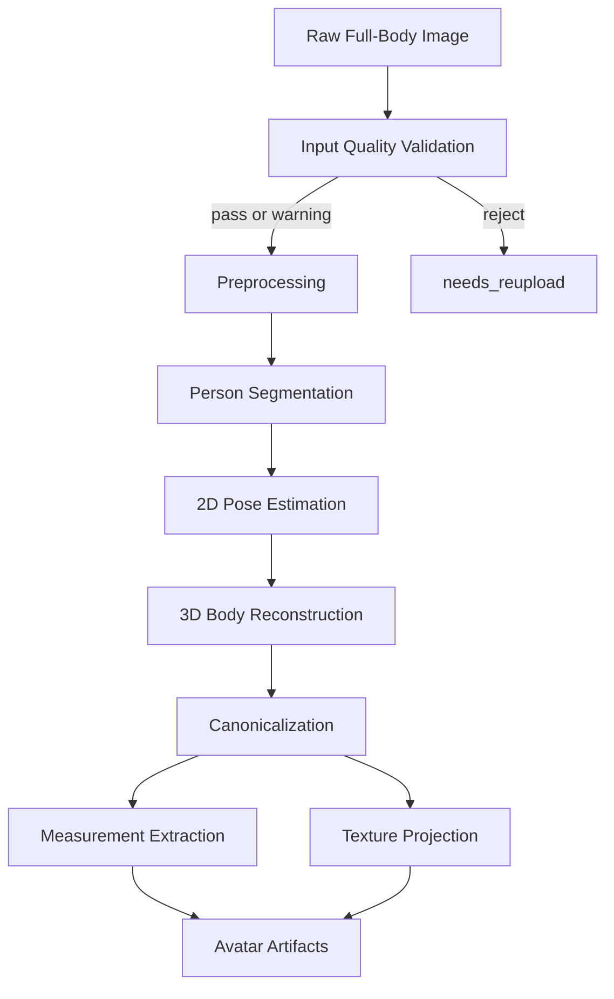

### Stage-by-Stage Summary

#### 1. Input Quality Validation

검사 항목:

- 단일 인물 여부
- 전신 포함 여부
- 손/발/머리 절단 여부
- severe occlusion 여부
- blur 수준
- 저조도 여부
- extreme perspective 여부

판정 결과:

- `pass`
- `warning`
- `reject`

`reject` 결과 시 처리:

- `needs_reupload` 전이
- 재촬영 가이드 반환

#### 2. Preprocessing

- EXIF orientation 정리
- 색공간 표준화
- 해상도 리사이즈
- person bbox 탐지
- center crop 생성
- 원본/정규화본 저장

#### 3. Person Segmentation

출력:

- binary mask
- soft matte
- masked preview

용도:

- body reconstruction 보조
- pose estimation 보조
- texture projection 기반

#### 4. 2D Pose Estimation

출력:

- keypoints
- confidence
- orientation

용도:

- body initialization
- 방향 정렬
- quality scoring

#### 5. 3D Body Reconstruction

출력:

- SMPL 또는 SMPL-X parameters
- raw body mesh
- camera parameters

중요 포인트:

- 실제 몸 완전 복원 목적 아님
- fitting 기준으로 활용 가능한 body 추정치 확보 목적

#### 6. Canonicalization

정규화 목표:

- 좌표계 통일
- A-pose 또는 T-pose 정렬
- pelvis 원점 정렬
- meter 단위 통일
- skeleton naming 통일

#### 7. Measurement Extraction

예시 항목:

- height
- shoulder width
- chest
- waist
- hip
- upper arm
- thigh
- inseam
- arm length

표현 정책:

- 실제 치수 단정 금지
- "예상 치수" 또는 "피팅 기준 치수" 권장

#### 8. Texture Projection

전면 사진 기준 전략:

- 전면 가시 영역 직접 투영
- 후면/측면 추정 또는 neutral fill
- 완전 복원보다 시각적 일관성 우선

### AI Output Contract

필수 산출물:

- canonical body mesh
- preview `.glb`
- measurements JSON
- texture assets
- quality scores

## 12. Garment Asset Pipeline

### Garment Standardization Importance

런타임 품질 좌우 핵심 요소:

- garment asset 품질
- garment metadata 완성도
- pose/unit/origin 일관성

### Garment Asset Lifecycle

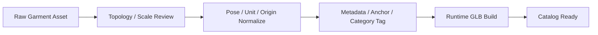

### Required Garment Metadata

| 필드 | 설명 |
|---|---|
| `category` | 상의/하의/아우터/원피스 분류 |
| `base_size` | 기준 사이즈 |
| `supported_sizes` | 지원 사이즈 목록 |
| `gender_profile` | male/female/unisex 등 |
| `fabric_type` | 재질 유형 |
| `fit_profile` | fast fit / cloth sim 가능 여부 |
| `anchor_points` | alignment 기준 포인트 |
| `collision_margin` | body와의 최소 여유값 |
| `material_profiles` | PBR 관련 설정 |

### Early Supported Categories

- `top`
- `bottom`
- `outer`
- `dress`

후순위 카테고리:

- `set`
- `shoes`
- `accessory`

## 13. Virtual Fitting Engine

### Fitting Layer Purpose

- body와 garment의 실제 결합 처리
- measurement 기반 scaling
- rig/anchor alignment
- collision 보정
- draping 결과 생성

### Fitting Modes

| 모드 | 의미 | 특징 |
|---|---|---|
| `fast` | MVP 기본 모드 | 빠른 처리, 안정성 우선 |
| `high_quality` | 품질 우선 모드 | 시뮬레이션 추가, 느린 처리 |

### Fast Fit Pipeline

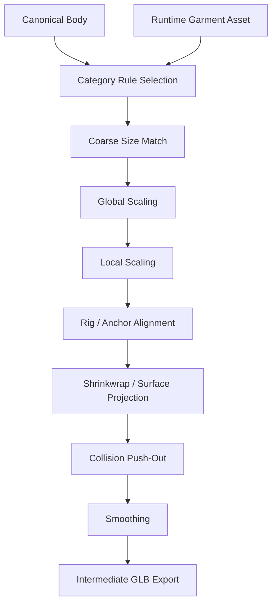

### High Quality Fit Pipeline

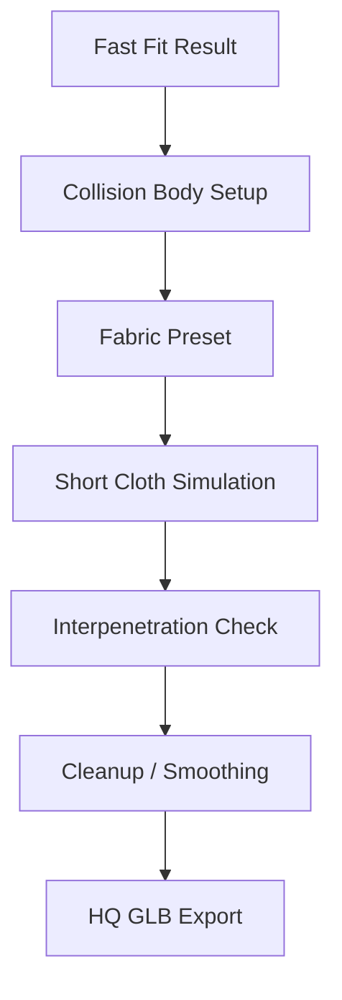

### Category Rule Summary

#### Top

- shoulder width
- chest circumference
- sleeve length
- neck opening

#### Bottom

- waist
- hip
- thigh
- inseam

#### Outer

- 상의 기준 + layering allowance

#### Dress

- upper/lower body 동시 반영
- 길이 조정 규칙 추가 필요

### Collision Handling Priority

- penetration 탐지
- outward push
- 민감 부위 우선 보정
- 과도한 찌그러짐 억제

### Export Strategy

- body mesh와 garment mesh의 scene 내 분리 유지 권장
- material 분리 유지 권장
- debug export 별도 보관 권장

## 14. Data Architecture

### Primary Collections

- `users`
- `jobs`
- `avatars`
- `garments`
- `results`
- `job_events`

### Entity Relationship Diagram

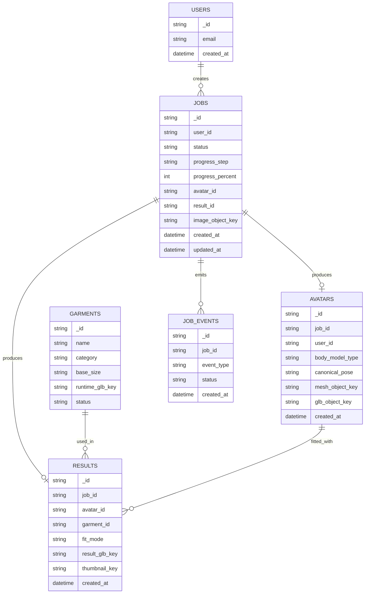

### Data Design Principles

- 메타데이터와 바이너리 분리
- MongoDB에는 object key와 상태 위주 저장
- 대용량 mesh/texture는 object storage 저장
- job과 artifact 관계 추적 가능 구조 중요

## 15. Storage Layout

### Object Key Convention

```text
raw-images/{yyyy}/{mm}/{dd}/{jobId}/original.jpg
preprocessed/{jobId}/normalized.png
masks/{jobId}/person_mask.png
poses/{jobId}/keypoints.json
avatars/{avatarId}/body_canonical.obj
avatars/{avatarId}/body_preview.glb
avatars/{avatarId}/textures/albedo.png
avatars/{avatarId}/textures/normal.png
garments/{garmentId}/source.glb
garments/{garmentId}/runtime.glb
results/{resultId}/final.glb
results/{resultId}/thumbnail.jpg
results/{resultId}/debug/before_drape.glb
results/{resultId}/debug/collision.json
```

### Storage Policy

- raw image: 짧은 TTL 권장
- intermediate artifacts: 운영 정책 기반 자동 정리
- final results: 제품 정책 또는 사용자 정책 기반 보관
- failed debug artifacts: 제한적 기간 보관

## 16. Queue and Worker Topology

### Queue Split

- `gpu.reconstruct`
- `fit.blender`
- `optimize.result`

### Worker Flow Diagram

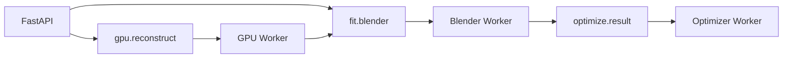

### Retry Strategy

| 실패 유형 | 처리 방향 |
|---|---|
| 입력 이미지 불량 | 재시도 없음, 재업로드 유도 |
| storage 일시 장애 | backoff 후 재시도 |
| Blender crash | 제한적 재시도 후 fail |
| GPU OOM | concurrency 축소 또는 delayed retry |
| optimizer 실패 | 비최적화 glb fallback 검토 |

### Backpressure Policy

- queue 길이 기반 신규 요청 제한
- 예상 대기 시간 사용자 노출
- `high_quality` fitting 우선순위 분리 가능

## 17. Deployment Topology

### Recommended Initial Deployment

- Web App: 정적 호스팅 또는 reverse proxy 뒤 배포
- API Server: FastAPI
- Queue Broker: Redis
- Metadata DB: MongoDB
- Object Storage: S3 또는 MinIO
- GPU Node: reconstruction worker
- Compute Node: Blender worker
- Compute Node: optimizer worker

### Deployment Diagram

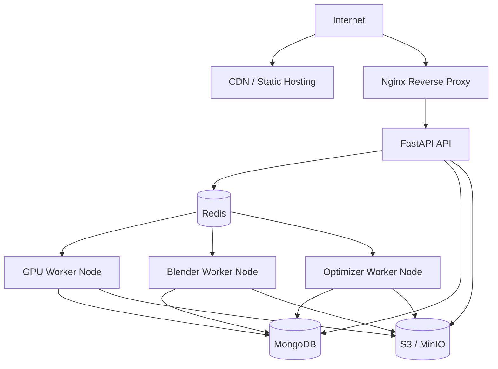

### Single RTX 3090 Operation Consideration

- reconstruction concurrency: 1부터 시작 권장
- GPU memory 관측 후 확장 판단
- Blender sim과 GPU inference의 자원 경쟁 계측 필요
- batch job 폭주 시 admission control 중요

## 18. Security and Privacy

### Security Principles

- presigned URL 만료 시간 짧게 유지
- 사용자별 object namespace 분리
- 결과 URL의 signed URL 또는 CDN token 제어
- 관리자 API의 별도 auth scope 필요

### Privacy Principles

- 원본 이미지 장기 보관 지양
- debug artifact 단기 보관 권장
- 모델 개선용 데이터 재사용 시 별도 동의 필요
- 로그 내 이미지 바이너리 저장 금지

### Example Retention Policy

| 자산 | 예시 보존 기간 |
|---|---|
| raw image | 7일 |
| intermediate artifacts | 7~30일 |
| final results | 정책 기반 |
| failed debug artifacts | 짧은 TTL |

## 19. Observability and QA

### Observability Goals

- 실패 단계 즉시 식별 가능성
- job 기준 end-to-end 추적 가능성
- GPU 및 worker 병목 파악 가능성
- garment별 실패율 비교 가능성

### Required Correlation IDs

- `job_id`
- `user_id`
- `avatar_id`
- `result_id`

### Key Metrics

- job 생성 수
- reconstruction 성공률
- fitting 성공률
- 단계별 평균 소요 시간
- P95 total latency
- GPU utilization
- GPU memory
- Blender crash rate
- average final glb size

### QA Scope

| 영역 | 테스트 포인트 |
|---|---|
| Frontend | upload validation, progress UI, viewer smoke test |
| Backend | API contract, auth, state transition |
| AI | quality gating, reconstruction consistency |
| Fitting | garment golden sample, collision regression |
| Optimization | glb validity, asset size regression |

### QA Workflow Diagram

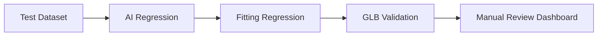

## 20. Performance Targets

### KPI Targets

| 항목 | 목표 |
|---|---|
| median total processing time | `< 45s` |
| P95 total processing time | `< 90s` |
| reconstruction success rate | `> 85%` |
| fitting completion rate | `> 90%` |
| severe mesh penetration rate | `< 5%` |

### Main Performance Levers

- 입력 해상도 제한
- canonical body 계산 최적화
- fast fit 기본화
- meshopt / KTX2 적용
- worker concurrency 제어

## 21. Failure Handling

### Failure Category Diagram

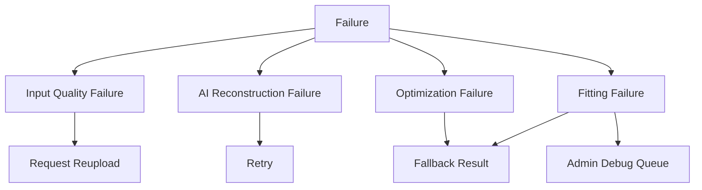

### Failure Summary

#### Input Failure

주요 원인:

- 전신 미포함
- 다중 인물
- 심한 blur
- 심한 occlusion

주요 대응:

- `needs_reupload`
- 재촬영 가이드 제공

#### Reconstruction Failure

주요 원인:

- loose clothing
- extreme pose
- low confidence

주요 대응:

- fail 또는 warning 결과
- high quality fitting 제한 가능

#### Fitting Failure

주요 원인:

- garment anchor mismatch
- 잘못된 size metadata
- cloth sim 불안정

주요 대응:

- fast fit fallback
- 해당 garment 임시 비활성화
- 관리자 검수 큐 등록

#### Optimization Failure

주요 원인:

- glTF compression 오류
- texture encode 실패

주요 대응:

- intermediate glb fallback 제공

## 22. Repository Blueprint

### Recommended Repository Structure

```text
/
├── apps/
│   ├── web/
│   └── api/
├── workers/
│   ├── gpu-worker/
│   ├── blender-worker/
│   └── optimizer-worker/
├── packages/
│   ├── shared-types/
│   └── shared-config/
├── assets/
│   ├── garments/
│   └── hdri/
├── scripts/
│   ├── blender/
│   └── data/
├── infra/
│   ├── docker/
│   ├── nginx/
│   └── monitoring/
├── plan.md
└── README.md
```

### Directory Responsibility

| 경로 | 역할 |
|---|---|
| `apps/web` | React + R3F 사용자 앱 |
| `apps/api` | FastAPI API 서버 |
| `workers/gpu-worker` | body reconstruction pipeline |
| `workers/blender-worker` | Blender fitting 작업 |
| `workers/optimizer-worker` | glTF/texture 최적화 |
| `packages/shared-types` | 공통 DTO 및 이벤트 타입 |
| `packages/shared-config` | 공통 설정 및 환경 변수 |
| `assets/garments` | garment 샘플 자산 |
| `scripts/blender` | Blender automation scripts |

## 23. Roadmap

### Phase Diagram

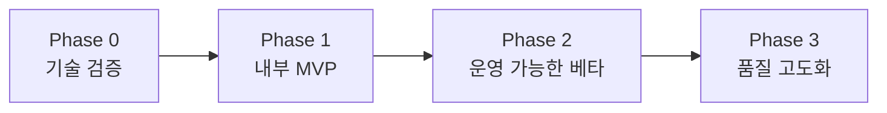

### Phase 0

목표:

- 단일 이미지 기반 body reconstruction 가능성 검증
- canonical body 정합성 확인
- garment 1종 fast fit 성공

산출물:

- 내부 CLI pipeline
- 샘플 `.glb`
- 처리 시간 benchmark

### Phase 1

목표:

- 업로드 웹 화면
- job 상태 표시
- garment 3~5종 지원
- viewer 동작

### Phase 2

목표:

- garment admin flow
- quality scoring
- optimizer 도입
- observability 도입

### Phase 3

목표:

- cloth sim 개선
- texture 품질 향상
- multi-view 입력 검토
- size recommendation 보조 기능
